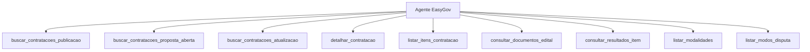
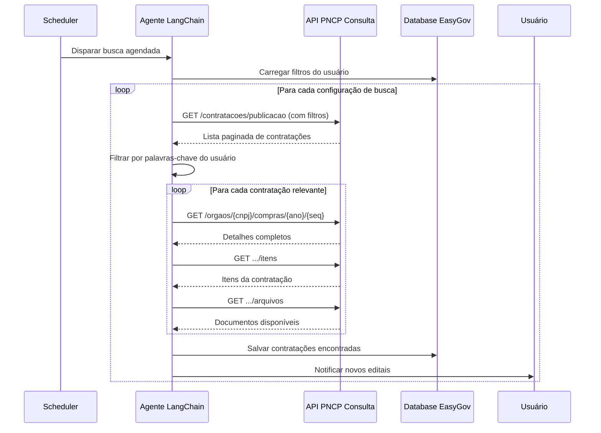

# Mapeamento API PNCP — Endpoints de Contratação & LangChain Agent

> Documento de referência para construção do Agente EasyGov

---

## 1. Visão Geral das APIs

| API | Base URL | Propósito |
|-----|----------|-----------|
| **API PNCP** | `/api/pncp` | Manutenção (CRUD) — requer autenticação Bearer |
| **API Consulta PNCP** | `/api/consulta` | Consultas públicas — sem autenticação |

> [!IMPORTANT]
> Para o Agente EasyGov, os **endpoints de Consulta** (`/api/consulta`) são os mais relevantes, pois permitem busca pública de editais sem necessidade de credenciais de órgão publicador.

---

## 2. Endpoints de Consulta (API Consulta PNCP) — Foco do Agente

### 2.1 Consultar Contratação Individual

| Campo | Valor |
|-------|-------|
| **Endpoint** | `GET /v1/orgaos/{cnpj}/compras/{ano}/{sequencial}` |
| **Operação** | `consultarCompra` |
| **Descrição** | Recupera os detalhes completos de uma contratação específica |

**Parâmetros (path):**

| Parâmetro | Tipo | Obrigatório | Descrição |
|-----------|------|:-----------:|-----------|
| `cnpj` | string (padrão CNPJ) | ✅ | CNPJ do órgão |
| `ano` | int32 | ✅ | Ano da compra |
| `sequencial` | int32 (≥1) | ✅ | Sequencial da compra |

**Resposta:** `RecuperarCompraDTO`

---

### 2.2 Consultar Contratações por Data de Publicação ⭐

| Campo | Valor |
|-------|-------|
| **Endpoint** | `GET /v1/contratacoes/publicacao` |
| **Operação** | `consultarContratacaoPorDataDePublicacao` |
| **Descrição** | Busca contratações publicadas em um período — **principal para monitoramento de novos editais** |

**Parâmetros (query):**

| Parâmetro | Tipo | Obrigatório | Descrição |
|-----------|------|:-----------:|-----------|
| `dataInicial` | string (data) | ✅ | Data início da publicação |
| `dataFinal` | string (data) | ✅ | Data fim da publicação |
| `codigoModalidadeContratacao` | int64 | ✅ | Código da modalidade (Pregão, Dispensa, etc.) |
| `codigoModoDisputa` | int32 | ❌ | Modo de disputa (aberto, fechado, etc.) |
| `uf` | string | ❌ | Sigla do estado (ex: SP, RJ) |
| `codigoMunicipioIbge` | string | ❌ | Código IBGE do município |
| `cnpj` | string | ❌ | CNPJ do órgão específico |
| `codigoUnidadeAdministrativa` | string | ❌ | Unidade administrativa do órgão |
| `idUsuario` | int64 | ❌ | ID do usuário responsável |
| `pagina` | int32 (≥1) | ✅ | Número da página |
| `tamanhoPagina` | int32 (10-50) | ❌ | Itens por página (padrão presumido: 10) |

**Resposta:** `PaginaRetornoRecuperarCompraPublicacaoDTO`

---

### 2.3 Consultar Contratações com Recebimento de Propostas Aberto ⭐⭐

| Campo | Valor |
|-------|-------|
| **Endpoint** | `GET /v1/contratacoes/proposta` |
| **Operação** | `consultarContratacaoPeriodoRecebimentoPropostas` |
| **Descrição** | Busca contratações ainda **com prazo de propostas aberto** — **mais crítico para o agente de busca automática** |

**Parâmetros (query):**

| Parâmetro | Tipo | Obrigatório | Descrição |
|-----------|------|:-----------:|-----------|
| `dataFinal` | string (data) | ✅ | Data limite para encerramento de recebimento |
| `codigoModalidadeContratacao` | int64 | ❌ | Código da modalidade |
| `uf` | string | ❌ | Sigla do estado |
| `codigoMunicipioIbge` | string | ❌ | Código IBGE do município |
| `cnpj` | string | ❌ | CNPJ do órgão |
| `codigoUnidadeAdministrativa` | string (1-30 chars) | ❌ | Unidade administrativa |
| `idUsuario` | int64 | ❌ | ID do usuário |
| `pagina` | int32 (≥1) | ✅ | Número da página |
| `tamanhoPagina` | int32 (10-50) | ❌ | Itens por página |

**Resposta:** `PaginaRetornoRecuperarCompraPublicacaoDTO`

---

### 2.4 Consultar Contratações por Data de Atualização Global

| Campo | Valor |
|-------|-------|
| **Endpoint** | `GET /v1/contratacoes/atualizacao` |
| **Operação** | `consultarContratacaoPorDataUltimaAtualizacao` |
| **Descrição** | Busca contratações atualizadas em um período — útil para **sincronização incremental** |

**Parâmetros (query):**

| Parâmetro | Tipo | Obrigatório | Descrição |
|-----------|------|:-----------:|-----------|
| `dataInicial` | string (data) | ✅ | Data início |
| `dataFinal` | string (data) | ✅ | Data fim |
| `codigoModalidadeContratacao` | int64 | ✅ | Código da modalidade |
| `codigoModoDisputa` | int32 | ❌ | Modo de disputa |
| `uf` | string | ❌ | Sigla do estado |
| `codigoMunicipioIbge` | string | ❌ | Código IBGE do município |
| `cnpj` | string | ❌ | CNPJ do órgão |
| `codigoUnidadeAdministrativa` | string | ❌ | Unidade administrativa |
| `idUsuario` | int64 | ❌ | ID do usuário |
| `pagina` | int32 (≥1) | ✅ | Número da página |
| `tamanhoPagina` | int32 (10-50) | ❌ | Itens por página |

**Resposta:** `PaginaRetornoRecuperarCompraPublicacaoDTO`

---

## 3. Endpoints da API PNCP (Manutenção) — Consultas GET Relevantes

Estes endpoints estão na API de manutenção mas possuem **operações GET** úteis para detalhar informações de uma contratação já identificada.

### 3.1 Consultar Todos os Itens de uma Contratação

| Campo | Valor |
|-------|-------|
| **Endpoint** | `GET /v1/orgaos/{cnpj}/compras/{ano}/{sequencial}/itens` |
| **Operação** | `pesquisarCompraItem` |

**Parâmetros:** `cnpj`, `ano`, `sequencial` (path) + `pagina`, `tamanhoPagina` (query)

### 3.2 Consultar Item Específico

| Campo | Valor |
|-------|-------|
| **Endpoint** | `GET /v1/orgaos/{cnpj}/compras/{ano}/{sequencial}/itens/{numeroItem}` |
| **Operação** | `recuperarCompraItem` |

### 3.3 Consultar Resultados de Item

| Campo | Valor |
|-------|-------|
| **Endpoint** | `GET /v1/orgaos/{cnpj}/compras/{ano}/{sequencial}/itens/{numeroItem}/resultados` |
| **Operação** | `recuperarResultados` |

### 3.4 Consultar Documentos/Editais de uma Contratação

| Campo | Valor |
|-------|-------|
| **Endpoint** | `GET /v1/orgaos/{cnpj}/compras/{ano}/{sequencial}/arquivos` |
| **Operação** | `recuperarInformacoesDocumentosCompra` |

**Parâmetros:** `cnpj`, `ano`, `sequencial` (path) + `pagina`, `tamanhoPagina` (query)

### 3.5 Recuperar Imagens de Item

| Campo | Valor |
|-------|-------|
| **Endpoint** | `GET /v1/orgaos/{cnpj}/compras/{ano}/{sequencial}/itens/{numeroItem}/imagem` |
| **Operação** | `getImagemLista` |

### 3.6 Consultar Atas de Registro de Preço por Compra

| Campo | Valor |
|-------|-------|
| **Endpoint** | `GET /v1/orgaos/{cnpj}/compras/{anoCompra}/{sequencialCompra}/atas` |
| **Operação** | `recuperarAtasPorFiltros` |

---

## 4. Modelo de Dados — Campos Retornados

### `RecuperarCompraDTO` (detalhe completo da contratação)

| Campo | Tipo | Descrição |
|-------|------|-----------|
| `numeroControlePNCP` | string | Número de controle único do PNCP |
| `objetoCompra` | string | Descrição do objeto da compra |
| `informacaoComplementar` | string | Informações adicionais |
| `modalidadeId` / `modalidadeNome` | int64 / string | Modalidade (Pregão, Dispensa, etc.) |
| `modoDisputaId` / `modoDisputaNome` | int64 / string | Modo de disputa |
| `tipoInstrumentoConvocatorioCodigo` / `Nome` | int64 / string | Tipo de edital |
| `valorTotalEstimado` | number | Valor estimado |
| `valorTotalHomologado` | number | Valor homologado |
| `dataPublicacaoPncp` | date-time | Data de publicação |
| `dataAberturaProposta` | date-time | Abertura de propostas |
| `dataEncerramentoProposta` | date-time | Encerramento de propostas |
| `situacaoCompraId` | enum (1-4) | Status da compra |
| `situacaoCompraNome` | string | Nome do status |
| `srp` | boolean | Se é Sistema de Registro de Preços |
| `linkSistemaOrigem` | string | Link do sistema de origem |
| `linkProcessoEletronico` | string | Link do processo eletrônico |
| `orgaoEntidade` | objeto | Dados do órgão (CNPJ, razão social, poder, esfera) |
| `unidadeOrgao` | objeto | Unidade (UF, município, código IBGE, nome) |
| `anoCompra` / `sequencialCompra` | int32 | Identificadores da compra |
| `existeResultado` | boolean | Se já possui resultado |

---

## 5. Tabelas de Domínio Requeridas

Para que os filtros funcionem na interface web, o agente precisa conhecer os valores válidos:

### 5.1 Modalidades de Contratação (`codigoModalidadeContratacao`)

| Código Provável | Modalidade |
|:-:|------------|
| 1 | Leilão - Eletrônico |
| 2 | Diálogo Competitivo |
| 3 | Concurso |
| 4 | Concorrência - Eletrônica |
| 5 | Concorrência - Presencial |
| 6 | Pregão - Eletrônico |
| 7 | Pregão - Presencial |
| 8 | Dispensa de Licitação |
| 9 | Inexigibilidade |
| 10 | Leilão - Presencial |
| 12 | Pré-qualificação |
| 13 | Credenciamento |
| 14 | Manifestação de Interesse |

> [!NOTE]
> Os códigos exatos devem ser validados via endpoint `GET /v1/modalidades` da API PNCP.

### 5.2 Modos de Disputa (`codigoModoDisputa`)

Disponíveis via `GET /v1/modos-disputas`. Valores comuns: Aberto, Fechado, Aberto-Fechado, Dispensa com Disputa.

### 5.3 Situação da Compra (`situacaoCompraId`)

| ID | Status estimado |
|:--:|-----------------|
| 1 | Divulgada (publicada) |
| 2 | Revogada |
| 3 | Anulada |
| 4 | Suspensa |

---

## 6. Parâmetros para a Interface Web do Usuário

Com base na análise, estes são os **filtros que o usuário pode configurar** para buscas automáticas:

### Filtros de Busca Automática

| Filtro | Tipo UI | Obrigatório | Notas |
|--------|---------|:-----------:|-------|
| **Modalidade de Contratação** | Dropdown/Multi-select | ✅ (publicação/atualização) | Pregão, Dispensa, Concorrência, etc. |
| **UF (Estado)** | Dropdown todos os estados | ❌ | Sigla: SP, RJ, MG, etc. |
| **Município** | Autocomplete (código IBGE) | ❌ | Depende da UF |
| **CNPJ do Órgão** | Input com máscara CNPJ | ❌ | Para monitorar órgão específico |
| **Unidade Administrativa** | Input texto | ❌ | Código da unidade |
| **Modo de Disputa** | Dropdown | ❌ | Aberto, Fechado, etc. |
| **Tipo de Busca** | Radio/Toggle | ✅ | Publicação / Proposta Aberta / Atualização |
| **Período/Frequência** | Date range + cron | ✅ | Intervalo e frequência da busca |
| **Palavras-chave no objeto** | Tags input | ❌ | Filtragem pós-busca no agente |

> [!IMPORTANT]
> A API **não possui filtro de texto** (busca por palavras-chave no objeto). Essa filtragem deve ser implementada **no lado do Agente LangChain** após recuperar os resultados da API.

---

## 7. Mapa de Funcionalidades para o Agente LangChain

### 7.1 Tools (Ferramentas)

### Tool 1: `buscar_contratacoes_publicacao`
- **API:** `GET /api/consulta/v1/contratacoes/publicacao`
- **Uso:** Busca periódica de novas contratações publicadas
- **Params:** `dataInicial`, `dataFinal`, `codigoModalidadeContratacao`, `uf`, `codigoMunicipioIbge`, `cnpj`, `codigoModoDisputa`, `pagina`, `tamanhoPagina`

### Tool 2: `buscar_contratacoes_proposta_aberta`
- **API:** `GET /api/consulta/v1/contratacoes/proposta`
- **Uso:** Busca contratações com **prazo de proposta ainda aberto**
- **Params:** `dataFinal`, `codigoModalidadeContratacao`, `uf`, `codigoMunicipioIbge`, `cnpj`, `pagina`, `tamanhoPagina`

### Tool 3: `buscar_contratacoes_atualizacao`
- **API:** `GET /api/consulta/v1/contratacoes/atualizacao`
- **Uso:** Sincronização incremental — detectar mudanças em contratações existentes
- **Params:** `dataInicial`, `dataFinal`, `codigoModalidadeContratacao`, `codigoModoDisputa`, `uf`, `codigoMunicipioIbge`, `cnpj`, `pagina`, `tamanhoPagina`

### Tool 4: `detalhar_contratacao`
- **API:** `GET /api/consulta/v1/orgaos/{cnpj}/compras/{ano}/{sequencial}`
- **Uso:** Obter dados completos de uma contratação específica
- **Params:** `cnpj`, `ano`, `sequencial`

### Tool 5: `listar_itens_contratacao`
- **API:** `GET /api/pncp/v1/orgaos/{cnpj}/compras/{ano}/{sequencial}/itens`
- **Uso:** Listar os itens/lotes de uma contratação
- **Params:** `cnpj`, `ano`, `sequencial`, `pagina`, `tamanhoPagina`

### Tool 6: `consultar_documentos_edital`
- **API:** `GET /api/pncp/v1/orgaos/{cnpj}/compras/{ano}/{sequencial}/arquivos`
- **Uso:** Recuperar a lista de documentos (editais, anexos) da contratação
- **Params:** `cnpj`, `ano`, `sequencial`, `pagina`, `tamanhoPagina`

### Tool 7: `consultar_resultados_item`
- **API:** `GET /api/pncp/v1/orgaos/{cnpj}/compras/{ano}/{sequencial}/itens/{numeroItem}/resultados`
- **Uso:** Ver resultados (vencedores) de um item específico
- **Params:** `cnpj`, `ano`, `sequencial`, `numeroItem`

### Tool 8: `listar_modalidades`
- **API:** `GET /api/pncp/v1/modalidades`
- **Uso:** Popular dropdown de modalidades na interface
- **Params:** nenhum

### Tool 9: `listar_modos_disputa`
- **API:** `GET /api/pncp/v1/modos-disputas`
- **Uso:** Popular dropdown de modos de disputa na interface
- **Params:** nenhum

---

### 7.2 Funcionalidades do Agente

| # | Funcionalidade | Tools Envolvidas | Descrição |
|:-:|----------------|------------------|-----------|
| 1 | **Monitoramento de novas publicações** | Tool 1 + filtros do usuário | Job periódico buscando novos editais por modalidade/UF/município |
| 2 | **Alerta de propostas abertas** | Tool 2 | Busca contratações com prazo de proposta ainda aberto |
| 3 | **Detalhamento automático** | Tools 4 + 5 + 6 | Ao encontrar edital relevante, detalhá-lo e anexar documentos |
| 4 | **Filtragem por palavras-chave** | Pós-processamento | Filtrar `objetoCompra` e `informacaoComplementar` após a busca |
| 5 | **Acompanhamento de resultados** | Tools 3 + 7 | Detectar quando contratações monitoradas recebem resultado |
| 6 | **Descoberta de tabelas de domínio** | Tools 8 + 9 | Popular interface com valores válidos para filtros |
| 7 | **Paginação automática** | Todas as tools de lista | Navegar automaticamente por todas as páginas de resultado |
| 8 | **Download de editais/documentos** | Tool 6 | Listar e disponibilizar documentos para download |

---

### 7.3 Fluxo de Busca Automática

---

## 8. Observações Técnicas

1. **Rate Limiting:** Não documentado na API. Implementar throttling no agente (ex: 1 req/seg).
2. **Paginação:** Máximo de 50 itens/página nos endpoints de contratação. Implementar loop de paginação.
3. **Formato de Datas:** Os parâmetros de data seguem formato `YYYY-MM-DD` ou `YYYY-MM-DDTHH:mm:ss`.
4. **CNPJ:** Aceita formato com ou sem pontuação: `XX.XXX.XXX/XXXX-XX`.
5. **Autenticação:** Endpoints de consulta (`/api/consulta`) parecem ser públicos. Endpoints de manutenção (`/api/pncp`) requerem Bearer Token.
6. **Base URL real:** Provável `https://pncp.gov.br/api/consulta` ou `https://treina.pncp.gov.br/api/consulta` para testes.
