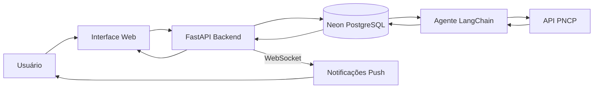
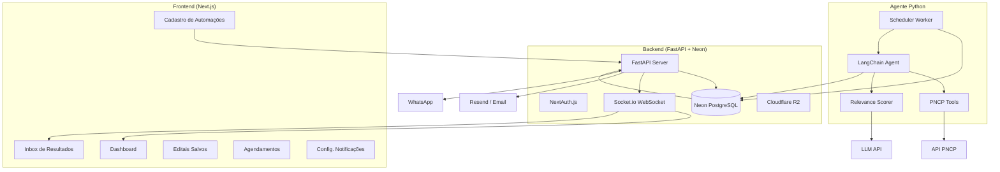
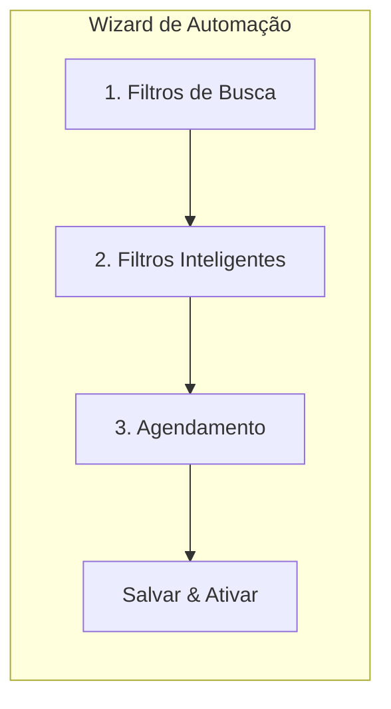
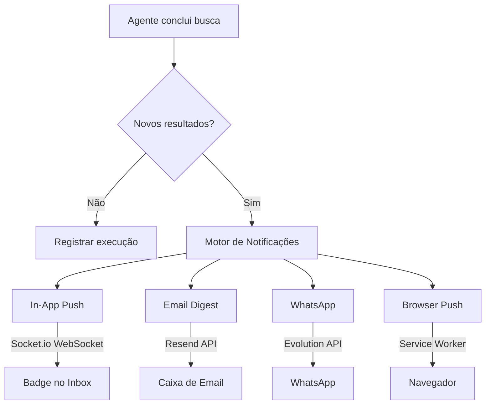
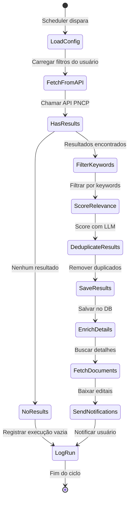

# Plano de Implementação — EasyGov Agent + Sistema Web

---

## 1. Visão do Produto

O EasyGov é uma plataforma que combina um **Agente de IA** (LangChain) com uma **interface web** para automatizar a busca e monitoramento de editais de pregões e dispensas no Portal Nacional de Contratações Públicas (PNCP).

O usuário cadastra suas preferências de busca uma vez, e o agente trabalha em background monitorando novas oportunidades, notificando o usuário e organizando os resultados para análise.



---

## 2. Stack Tecnológica Recomendada

### Frontend — Interface Web

| Componente | Tecnologia | Justificativa |
|------------|-----------|---------------|
| Framework | **Next.js 14+ (App Router)** | SSR, rotas dinâmicas, server actions |
| UI Components | **Shadcn/UI** | Componentes acessíveis, customizáveis |
| Estilização | **Tailwind CSS** | Produtividade e consistência |
| Estado Global | **Zustand** ou React Context | Leve e pragmático |
| Formulários | **React Hook Form + Zod** | Validação tipada |
| Gráficos | **Recharts** | Dashboard analytics |
| Notificações in-app | **Socket.io Client** | WebSocket para notificações realtime |

### Backend / Infraestrutura

| Componente | Tecnologia | Justificativa |
|------------|-----------|---------------|
| Database | **Neon (PostgreSQL Serverless)** | Branching, auto-scaling, serverless, free tier generoso |
| ORM | **Drizzle ORM** (frontend) + **SQLAlchemy** (agent) | Type-safe queries no Next.js, async no Python |
| Autenticação | **NextAuth.js (Auth.js v5)** | Integração nativa com Next.js, Google/GitHub/email |
| API Backend | **FastAPI** (Python) | Unificado com o agente, async, autodocumentado |
| Storage (PDFs) | **Cloudflare R2** ou **AWS S3** | Object storage para editais baixados |
| Realtime | **Socket.io** (via FastAPI) | WebSocket para notificações in-app |
| Notif. Email | **Resend** | API moderna, boa DX, plano free |
| Notif. WhatsApp | **Evolution API** (self-hosted) ou **Twilio** | Alertas via WhatsApp |
| Push Browser | **Web Push API + service worker** | Notificações no navegador |

### Agente de IA

| Componente | Tecnologia | Justificativa |
|------------|-----------|---------------|
| Linguagem | **Python 3.11+** | Ecossistema ML/LLM consolidado |
| Framework | **LangChain + LangGraph** | Orquestração de agentes com estado |
| LLM | **GPT-4o-mini** ou **Claude Haiku** | Análise de relevância (custo-efetivo) |
| Scheduler | **Celery + Redis** | Agendamento robusto e distribuído |
| Alternativa leve | **APScheduler** | Caso queira simplicidade sem Redis |
| HTTP Client | **httpx** (async) | Chamadas assíncronas à API PNCP |
| Containerização | **Docker + Docker Compose** | Deploy reprodutível |
| Deploy | **Railway** ou **Fly.io** | FastAPI + Worker Python com custo baixo |

> [!TIP]
> **Alternativa simplificada:** Para uma v1, o agente Python pode usar `APScheduler` em vez de Celery+Redis, reduzindo a complexidade operacional. Migrar para Celery quando escalar.

---

## 3. Arquitetura de Módulos



---

## 4. Modelagem de Dados (Neon PostgreSQL)

```sql
-- Perfil do usuário
CREATE TABLE users (
    id UUID PRIMARY KEY DEFAULT gen_random_uuid(),
    email TEXT UNIQUE NOT NULL,
    name TEXT,
    image TEXT,
    email_verified TIMESTAMPTZ,
    created_at TIMESTAMPTZ DEFAULT now(),
    updated_at TIMESTAMPTZ DEFAULT now()
);

-- NextAuth.js tables
CREATE TABLE accounts (
    id UUID PRIMARY KEY DEFAULT gen_random_uuid(),
    user_id UUID REFERENCES users(id) ON DELETE CASCADE,
    type TEXT NOT NULL,
    provider TEXT NOT NULL,
    provider_account_id TEXT NOT NULL,
    refresh_token TEXT,
    access_token TEXT,
    expires_at INTEGER,
    token_type TEXT,
    scope TEXT,
    id_token TEXT,
    session_state TEXT,
    UNIQUE(provider, provider_account_id)
);

CREATE TABLE sessions (
    id UUID PRIMARY KEY DEFAULT gen_random_uuid(),
    session_token TEXT UNIQUE NOT NULL,
    user_id UUID REFERENCES users(id) ON DELETE CASCADE,
    expires TIMESTAMPTZ NOT NULL
);

-- Perfil estendido do usuário
CREATE TABLE profiles (
    id UUID PRIMARY KEY REFERENCES users(id) ON DELETE CASCADE,
    company_name TEXT,
    cnpj TEXT,
    phone TEXT,
    notification_email BOOLEAN DEFAULT true,
    notification_whatsapp BOOLEAN DEFAULT false,
    notification_push BOOLEAN DEFAULT true,
    whatsapp_number TEXT,
    created_at TIMESTAMPTZ DEFAULT now()
);

-- Automações de busca cadastradas pelo usuário
CREATE TABLE search_automations (
    id UUID PRIMARY KEY DEFAULT gen_random_uuid(),
    user_id UUID REFERENCES profiles(id) ON DELETE CASCADE,
    name TEXT NOT NULL,                          -- "Pregões de TI em SP"
    is_active BOOLEAN DEFAULT true,
    
    -- Filtros de busca (parâmetros da API PNCP)
    search_type TEXT NOT NULL DEFAULT 'publicacao', -- publicacao | proposta | atualizacao
    modalidade_ids INTEGER[],                    -- Array de códigos de modalidade
    uf TEXT,                                     -- Sigla do estado
    codigo_municipio_ibge TEXT,                  -- Código IBGE
    cnpj_orgao TEXT,                             -- CNPJ específico
    codigo_modo_disputa INTEGER,                 -- Modo de disputa
    
    -- Filtros pós-busca (aplicados pelo agente)
    keywords TEXT[],                             -- Palavras-chave no objeto
    keywords_exclude TEXT[],                     -- Palavras para excluir
    valor_minimo NUMERIC,                       -- Filtro de valor mínimo
    valor_maximo NUMERIC,                       -- Filtro de valor máximo
    
    -- Agendamento
    schedule_type TEXT DEFAULT 'interval',       -- interval | daily | custom
    interval_hours INTEGER DEFAULT 6,            -- A cada X horas
    daily_times TIME[],                          -- Horários fixos (ex: 08:00, 14:00)
    active_window_start TIME DEFAULT '07:00',    -- Janela ativa início
    active_window_end TIME DEFAULT '22:00',      -- Janela ativa fim
    timezone TEXT DEFAULT 'America/Sao_Paulo',
    
    last_run_at TIMESTAMPTZ,
    next_run_at TIMESTAMPTZ,
    created_at TIMESTAMPTZ DEFAULT now(),
    updated_at TIMESTAMPTZ DEFAULT now()
);

-- Resultados encontrados pelo agente (Inbox)
CREATE TABLE search_results (
    id UUID PRIMARY KEY DEFAULT gen_random_uuid(),
    automation_id UUID REFERENCES search_automations(id) ON DELETE CASCADE,
    user_id UUID REFERENCES profiles(id) ON DELETE CASCADE,
    
    -- Dados da contratação (snapshot da API PNCP)
    numero_controle_pncp TEXT NOT NULL,
    cnpj_orgao TEXT NOT NULL,
    ano_compra INTEGER NOT NULL,
    sequencial_compra INTEGER NOT NULL,
    objeto_compra TEXT,
    modalidade_nome TEXT,
    modo_disputa_nome TEXT,
    valor_total_estimado NUMERIC,
    data_publicacao TIMESTAMPTZ,
    data_abertura_proposta TIMESTAMPTZ,
    data_encerramento_proposta TIMESTAMPTZ,
    situacao_compra_nome TEXT,
    orgao_nome TEXT,
    uf TEXT,
    municipio TEXT,
    link_sistema_origem TEXT,
    link_processo_eletronico TEXT,
    srp BOOLEAN,
    
    -- Estado do resultado
    status TEXT DEFAULT 'pending',              -- pending | saved | discarded
    relevance_score REAL,                        -- 0-100, calculado pelo LLM
    relevance_reason TEXT,                       -- Explicação do score
    is_read BOOLEAN DEFAULT false,
    
    -- Metadados
    found_at TIMESTAMPTZ DEFAULT now(),
    acted_at TIMESTAMPTZ,                        -- Quando salvou/descartou
    
    UNIQUE(user_id, numero_controle_pncp)
);

-- Documentos/editais baixados
CREATE TABLE result_documents (
    id UUID PRIMARY KEY DEFAULT gen_random_uuid(),
    result_id UUID REFERENCES search_results(id) ON DELETE CASCADE,
    titulo TEXT,
    tipo_documento TEXT,
    storage_path TEXT,                           -- Path no Cloudflare R2 / S3
    url_original TEXT,
    downloaded_at TIMESTAMPTZ DEFAULT now()
);

-- Histórico de execuções do agente
CREATE TABLE automation_runs (
    id UUID PRIMARY KEY DEFAULT gen_random_uuid(),
    automation_id UUID REFERENCES search_automations(id) ON DELETE CASCADE,
    started_at TIMESTAMPTZ DEFAULT now(),
    finished_at TIMESTAMPTZ,
    status TEXT DEFAULT 'running',              -- running | success | error
    results_found INTEGER DEFAULT 0,
    results_new INTEGER DEFAULT 0,               -- Novos (não duplicados)
    error_message TEXT,
    pages_searched INTEGER DEFAULT 0
);

-- Notificações enviadas
CREATE TABLE notifications (
    id UUID PRIMARY KEY DEFAULT gen_random_uuid(),
    user_id UUID REFERENCES profiles(id) ON DELETE CASCADE,
    automation_id UUID REFERENCES search_automations(id),
    channel TEXT NOT NULL,                        -- in_app | email | whatsapp | push
    title TEXT NOT NULL,
    body TEXT,
    is_read BOOLEAN DEFAULT false,
    sent_at TIMESTAMPTZ DEFAULT now(),
    metadata JSONB
);

-- Tags/etiquetas do usuário para organização
CREATE TABLE tags (
    id UUID PRIMARY KEY DEFAULT gen_random_uuid(),
    user_id UUID REFERENCES profiles(id) ON DELETE CASCADE,
    name TEXT NOT NULL,
    color TEXT DEFAULT '#3B82F6',
    UNIQUE(user_id, name)
);

CREATE TABLE result_tags (
    result_id UUID REFERENCES search_results(id) ON DELETE CASCADE,
    tag_id UUID REFERENCES tags(id) ON DELETE CASCADE,
    PRIMARY KEY (result_id, tag_id)
);
```

---

## 5. Funcionalidades Detalhadas

### 5.1 Cadastro de Automações de Busca

**Tela: "Nova Automação"** — Wizard em 3 etapas:

**Etapa 1 — Filtros de Busca**
- Tipo de busca: Novas Publicações / Propostas Abertas / Atualizações
- Modalidades (multi-select com chips): Pregão Eletrônico, Dispensa, Concorrência, etc.
- Localização: UF (dropdown) → Município (autocomplete cascata)
- Órgão específico (opcional): busca por CNPJ ou nome
- Modo de disputa (opcional)

**Etapa 2 — Filtros Inteligentes**
- Palavras-chave inclusivas (tags): ex: "tecnologia", "software", "computadores"
- Palavras-chave exclusivas (tags): ex: "obras", "construção"
- Faixa de valor: slider ou inputs min/max
- SRP (Sistema de Registro de Preços): filtro toggle

**Etapa 3 — Agendamento**
- **Intervalo fixo:** A cada X horas (slider: 1h–24h)
- **Horários fixos:** Escolher horários específicos (ex: 08:00, 12:00, 18:00)
- **Janela ativa:** Horário de início e fim (evitar buscas de madrugada)
- **Fuso horário:** Detectar automaticamente
- Preview: "Esta automação rodará às 08:00, 14:00 e 20:00 (horário de Brasília)"



---

### 5.2 Inbox de Resultados

Inspirado no padrão de email inbox, com experiência rica:

**Layout:**
- Lista à esquerda com cards resumidos
- Detalhe completo à direita (split view)
- Badge com contagem de "não lidos" na sidebar

**Cada card de resultado mostra:**
- 🏷️ Modalidade (badge colorido)
- 📝 Objeto da compra (título truncado)
- 🏢 Órgão / UF
- 💰 Valor estimado
- 📅 Prazo de proposta (com countdown se próximo)
- ⭐ Score de relevância (barra ou número)
- Indicador visual: `Novo` / `Lido`

**Ações por resultado:**
- ✅ **Salvar** — move para "Editais Salvos"
- ❌ **Descartar** — esconde do inbox (recuperável)
- 🔖 **Adicionar tag/etiqueta**
- 📄 **Ver documentos/edital**
- 🔗 **Abrir no PNCP** (link externo)

**Ações em lote (batch):**
- Checkbox para selecionar múltiplos
- Barra de ações: "Salvar todos", "Descartar todos", "Marcar como lido"
- Filtro rápido: por automação, por modalidade, por status

---

### 5.3 Sistema de Notificações



**Canais configuráveis pelo usuário:**

| Canal | Comportamento | Config |
|-------|--------------|--------|
| **In-App (Realtime)** | Badge no menu + toast notification | Sempre ativo |
| **Email** | Digest com resumo dos editais encontrados | Ativar/desativar + frequência |
| **WhatsApp** | Mensagem com resumo e link direto | Ativar + informar número |
| **Browser Push** | Notificação nativa do navegador | Solicitar permissão |

**Regras de notification coalescing:**
- Se múltiplas automações encontram resultados no mesmo ciclo, agrupar numa única notificação
- Email: enviar digest consolidado (não uma mensagem por edital)
- WhatsApp: máximo 1 mensagem por hora (agrupar)

**Exemplo de email digest:**
```
🔔 EasyGov — 5 novos editais encontrados

Automação "Pregões TI - São Paulo":
  • Pregão Eletrônico nº 23/2026 - INSS
    Aquisição de licenças de software — R$ 450.000,00
    Prazo: até 28/02/2026
    
  • Dispensa nº 15/2026 - Receita Federal
    Serviços de manutenção de rede — R$ 78.000,00
    Prazo: até 01/03/2026

[Ver todos os resultados →]
```

---

### 5.4 Editais Salvos

**Tela "Meus Editais":**
- Cards organizados em grid ou lista
- Filtros: por tag, por modalidade, por prazo, por valor
- Ordenação: prazo (mais urgente), valor, data de publicação
- Ações: remover, adicionar nota, ver documentos, exportar
- **Timeline visual:** barra de progresso mostrando onde está no ciclo (Publicado → Propostas → Resultado)

---

### 5.5 Dashboard

**Métricas apresentadas:**
- Total de editais encontrados (período selecionável)
- Editais salvos vs descartados (taxa de relevância)
- Editais por modalidade (gráfico de pizza)
- Editais por UF/região (mapa de calor simplificado)
- Valor total dos editais monitorados
- Próximas execuções agendadas
- Timeline de editais com proposta prestes a encerrar

---

## 6. Funcionalidades Extras Sugeridas

### 6.1 Score de Relevância por IA ⭐
O agente usa o LLM para analisar o `objetoCompra` e comparar com o perfil/palavras-chave do usuário, gerando:
- Score numérico (0-100)
- Justificativa textual ("Edital relevante pois menciona 'software ERP' que está nas suas palavras-chave")
- Resultados ordenados por score no Inbox

### 6.2 Análise Automática de Documentos (Editais PDF)
- Agente faz download do PDF do edital
- Extrai com LLM: requisitos técnicos, qualificações exigidas, prazos, documentação necessária
- Apresenta um "resumo executivo" do edital na interface

### 6.3 Calendário de Prazos
- View de calendário integrado mostrando prazos de encerramento de propostas
- Alertas configuráveis: "avisar 3 dias antes do encerramento"

### 6.4 Busca Manual com IA (Chat)
- Campo de busca em linguagem natural: "Encontre pregões de material hospitalar no Rio de Janeiro"
- O agente traduz para chamadas à API PNCP e retorna resultados

### 6.5 Matching por CNAE
- Usuário cadastra seus CNAEs
- Agente cruza com categorias dos itens das contratações
- Sugere editais que combinem com a atividade da empresa

### 6.6 Monitoramento de Resultados
- Ao salvar um edital, opção de "monitorar resultado"
- Agente verifica periodicamente se o resultado foi publicado
- Notifica quando sair o resultado final (vencedor, homologação)

### 6.7 Exportação e Relatórios
- Exportar lista de editais salvos para Excel/CSV
- Gerar relatório PDF dos editais do mês
- Integração futura com CRM

### 6.8 Compartilhamento em Equipe
- Convidar membros da equipe (workspace)
- Compartilhar editais salvos com anotações
- Atribuir responsável por edital

---

## 7. Fases de Implementação

### Fase 1 — MVP (4-6 semanas)

| Semana | Entrega |
|:------:|---------|
| 1-2 | Setup do projeto (Next.js + Neon + FastAPI + Python agent) |
| 1-2 | Schema do banco de dados (Neon) + migrações (Drizzle) |
| 1-2 | Autenticação (NextAuth.js) |
| 2-3 | Agente Python com 3 tools (publicação, proposta, detalhe) |
| 2-3 | Task scheduler (APScheduler) |
| 3-4 | Tela de cadastro de automações (wizard) |
| 4-5 | Inbox de resultados (list + detail + save/discard) |
| 5-6 | Notificações in-app (Socket.io WebSocket) |
| 5-6 | Notificações email (Resend) |
| 6 | Dashboard básico + testes e2e |

### Fase 2 — Enriquecimento (3-4 semanas)

- Score de relevância por IA
- Batch actions no inbox
- Tags / etiquetas
- Editais salvos com timeline
- Calendário de prazos
- Notificação WhatsApp
- Browser push

### Fase 3 — Premium (4-6 semanas)

- Análise automática de PDF (edital)
- Busca em linguagem natural (chat)
- Matching por CNAE
- Monitoramento de resultados
- Exportação para Excel/PDF
- Compartilhamento em equipe
- Dashboard avançado com analytics

---

## 8. Fluxo Completo do Agente (LangGraph)



---

## 9. Segurança e Performance

| Aspecto | Abordagem |
|---------|-----------|
| **Isolamento de dados** | Queries sempre filtradas por `user_id`; middleware de auth no FastAPI |
| **Rate limiting API PNCP** | Máx 2 req/s, com retry exponencial |
| **Deduplicação** | `UNIQUE(user_id, numero_controle_pncp)` evita duplicados |
| **Timeout** | Cada ciclo do agente tem timeout de 5min |
| **Retry** | Falhas de rede com 3 retries + dead letter queue |
| **Logs** | Todas execuções registradas em `automation_runs` |
| **Quota** | Limite de automações por plano (free: 3, pro: ilimitado) |
